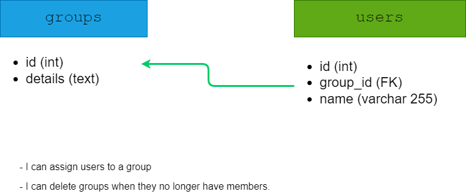

# Developer Notes

- Symfony `5.4.7` 
- API Platform `2.6`
- PHP `7.4.5`
- MySQL : `5.5.5-10.4.12-MariaDB-1:10.4.12+maria~bionic`
- **For development use only** 
- - `rm -rf migrations/* && php bin/console doctrine:database:drop --force && php bin/console doctrine:database:create && php bin/console make:migration && php bin/console doctrine:migrations:migrate --no-interaction && php bin/console doctrine:fixtures:load --no-interaction`
- - `php bin/console doctrine:query:sql 'TRUNCATE users; TRUNCATE groups;'`
- Postman Collection with list of endpoint as per specification : `postman_collection.json`

# Installation

- Download : `git clone https://github.com/fadilxcoder/ifox-api-test.git`
- Goto `ifox-api-test/docker/`
- Build project : `docker-compose up --build -d`
- Connect to project CLI : `docker exec -it fx_php_fpm ash`
- - `composer install`
- - `php bin/console doctrine:migrations:migrate --no-interaction && php bin/console doctrine:fixtures:load --no-interaction`
- Swagger GUI : http://localhost:8000/
- Adminer GUI : http://localhost:8000/adminer.php
- - **Server** : `database`
- - **Username** : `myuser`
- - **Password** : `secret`
- - **Database** : `mydb`
- **`X-Client` header authorization is required**
- - Generate token using : `php bin/console generate-x-client`
- - `X-Client` : `<THE_GENERATED_TOKEN_VALUE>`

# UML & Database structure

